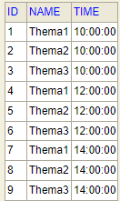
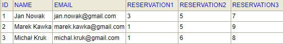
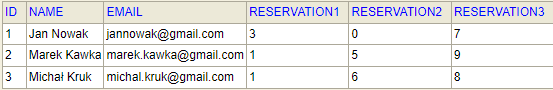

# IT Conference Service
###Software and technologies
-Postman<br>
-H2 database<br>
-IntelliJ IDEA or another IDE<br>
-Spring boot<br>
-Java 11
###Setup
####H2 Database setup
To run this project, install H2 database and run server:<br>
````
~H2\bin> java -cp h2-version.jar org.h2.tools.Server -webPort 8083
````
Next create table Reservations:<br>
````
CREATE TABLE RESERVATIONS(ID INT GENERATED BY DEFAULT AS IDENTITY, NAME VARCHAR(255),EMAIL VARCHAR(255), RESERVATION1 INT,RESERVATION2 INT, RESERVATION3 INT);
````
Create table Lectures and insert values:<br>
<br>
````
CREATE TABLE Lectures(id INT PRIMARY KEY,
   name VARCHAR(255),time TIME(7) );
INSERT INTO Lectures VALUES(1, 'Thema1','10:00');
INSERT INTO Lectures VALUES(2, 'Thema2','10:00');
INSERT INTO Lectures VALUES(3, 'Thema3','10:00');
INSERT INTO Lectures VALUES(4, 'Thema1','12:00');
INSERT INTO Lectures VALUES(5, 'Thema2','12:00');
INSERT INTO Lectures VALUES(6, 'Thema3','12:00');
INSERT INTO Lectures VALUES(7, 'Thema1','14:00');
INSERT INTO Lectures VALUES(8, 'Thema2','14:00');
INSERT INTO Lectures VALUES(9, 'Thema3','14:00');
````
####IDE Setup
Run project from Github in IntelliJ or another IDE and set appopriate properties for h2 database
````
spring.datasource.url=jdbc:h2:tcp://localhost/~/test
spring.datasource.username=sa
spring.datasource.password=
````
###Syntax
Show plan conference:
````
GET
http://localhost:8081/showConferencePlan
````
Show user's reservation plans:
````
GET
http://localhost:8081/reservationPlans/{name}
````
Add reservation by user:
````
POST
http://localhost:8081/addReservation
Body:
{
    "name": "test",
    "email": "test@gmail.com",
    "reservation1": 1,
    "reservation2": 5,
    "reservation3": 9
}
````
Cancel reservation:
````
PUT
http://localhost:8081/cancelReservation/{name}/{numberOfReservation}
````
Update email:
````
PUT
http://localhost:8081/updateEmail/{name}/{newEmail}
````
Show list of users in system:
````
GET
http://localhost:8081/users
````
Show stats lectures:
````
GET
http://localhost:8081/listOfLectures
````
Show stats themas:
````
GET
http://localhost:8081/listOfThemas
````
###Example
Request:
````
GET
http://localhost:8081/reservationPlans/Jan Nowak
````
Response:
````
[
    {
        "id": null,
        "name": "Thema3",
        "time": "10:00:00"
    },
    {
        "id": null,
        "name": "Thema2",
        "time": "12:00:00"
    },
    {
        "id": null,
        "name": "Thema1",
        "time": "14:00:00"
    }
]
````
Request:
````
POST
http://localhost:8081/addReservation
Body:
{
    "name": "Jan Nowak",
    "email": "jan.nowak@gmail.com",
    "reservation1": 3,
    "reservation2": 5,
    "reservation3": 7
}
````
Response:
````
Given login is busy!
````
Request:
````
POST
http://localhost:8081/addReservation
Body:
{
    "name": "Michał Kruk",
    "email": "michal.kruk@gmail.com",
    "reservation1": 1,
    "reservation2": 6,
    "reservation3": 8
}
````
Response:
````
Succesfull reservation!
````
<br>
Request:
````
PUT
http://localhost:8081/updateEmail/Jan Nowak/jannowak@gmail.com
````
Response:
````
Change email to: jannowak@gmail.com
````
Request:
````
PUT
http://localhost:8081/cancelReservation/Jan Nowak/2
````
Response:
````
Cancel reservation number: 2
````
<br>
Request:
````
GET
http://localhost:8081/listOfThemas
````
Response:
````
Thema 1: 37.5 % 
Thema 2: 25.0 % 
Thema 3: 37.5 %
````